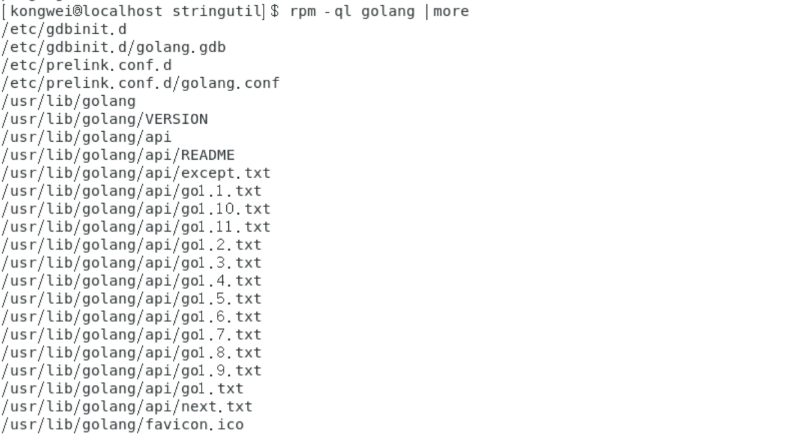
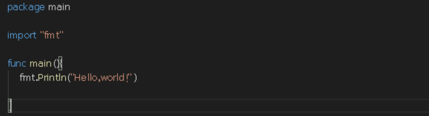
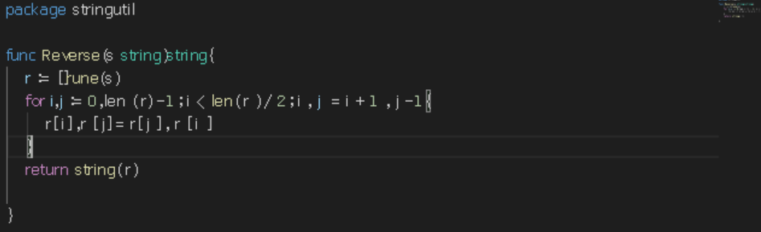
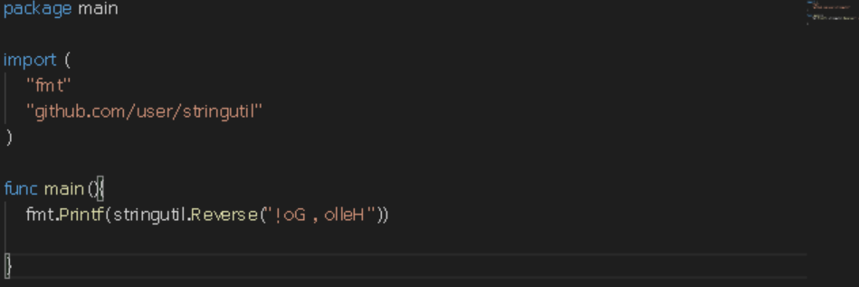
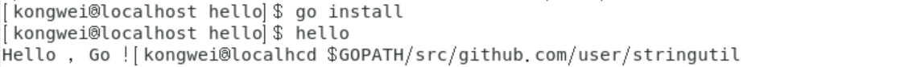
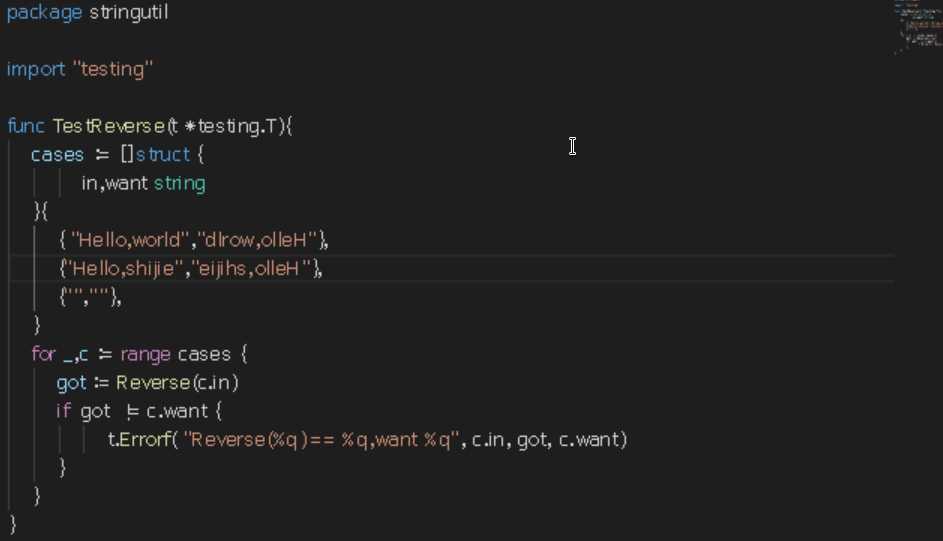
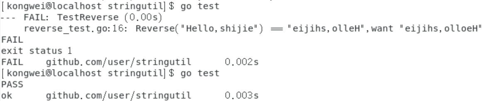

# Go编程小试

本次实验报告主要基于 官方文档 [如何使用Go编程](https://go-zh.org/doc/code.html) 进行实验，完成第一个包和第一个测试。

-----

## 1.安装VSCode编辑器

在作业报告1中已经完成了CentOS7的安装，为了完成实验的简便，补充安装了VSCode编辑器。

安装命令如下：

```go
    rpm --import https://packages.microsoft.com/keys/microsoft.asc
     
    sh -c 'echo -e "[code]\nname=Visual Studio Code\nbaseurl=https://packages.microsoft.com/yumrepos/vscode\nenabled=1\ngpgcheck=1\ngpgkey=https://packages.microsoft.com/keys/microsoft.asc" > /etc/yum.repos.d/vscode.repo'
     
    yum check-update
    yum install code
```

安装完成后，使用如下命令打开。

```go
	$ /usr/share/code/bin/code
```

# 2.安装golang

以CentOS7为例使用以下命令进行安装：

```go
	$ sudo yum install golang
```

查看安装目录：

```go
	$ rpm -ql golang |more
```

测试安装版本：

```go
	$ go version
```

实际效果如下：	


## 3.设置环境变量

GOPATH环境变量指定了工作空间位置。首先需要创建工作空间目录，并设置相应的GOPATH。

```go
    $ mkdir $HOME/work

    $ export GOPATH=$HOME/work

    $ export PATH=$PATH:$GOPATH/bin
```

使用命令`go env`可以查看具体环境变量的设定是否成功。

## 4.第一个程序实现

首先在工作空间中创建目录。

```
	$ mkdir -p $GOPATH/src/github.com/user
```

实现的第一个程序名为`hello.go`，因此创建相应的包目录：

```
	$ mkdir -p $GOPATH/src/github.com/user/hello
```


进入目录，使用指令 code hello.go创建文件，此后VSCode编辑器会自动打开，编辑如下Go代码：

```go
	package main

​	import "fmt"

​	func main(){

​		fmt.Println("Hello,world.\n")	

​	}
```



因为是在该目录中，因此直接使用`go install`产生二进制文件作为hello安装到工作空间的bin目录中，没有打印输出说明执行成功。

使用命令`$GOPATH/bin/hello`和`$hello`均可以输出成功。


## 5.第一个库实现

同样，第一步还是选择在当前工作空间内建立包目录并进入创建文件`reverse.go`：

```
    $ mkdir $GOPATH/src/github.com/user/stringutil

    $ cd $GOPATH/src/github.com/user/stringutil

    $ code reverse.go
```


reverse.go文件内容如下：

```go
package stringutil

func Reverse(s string) string{	

​	r := [ ]rune(s)

​	for i,j := 0,len(r) - 1;i < len(r)/2;i , j = i + 1,j - 1{

​		r[ i ] ,r[ j ] = r[ j ],r[ i ]   

​	}

​	return string(r) 

}
```



使用`go build`命令测试包的编译并修改原来的hello.go文件：

```go
package main

import （
	"fmt"
	“github.com/user/stringutil”
)

func main(){

​	fmt.Printf(stringutil.Reverse("!oG,olleH"))	

}
```



使用命令`go install`安装后运行`$hello`：



## 6.测试

在*stringutil*文件下创建`reverse_test.go`文件为`stringutil`添加测试，其内容如下：

```go
gopackage stringutil

import "testing"

func TestReverse(t *testing.T) {

​	cases := [ ]struct {

​		in,want string

​	}{

​		{"Hello,world","dlrow,olleH"},

​		{"Hello,shijie","eijihs,olleH"},

​		{"",""}

​	}

​	for _,c := range cases {

​		got := Reverse(c.in)

​		if got != c.want {

​			t.Errorf("Reverse(%q) == %q,want %q", c.in, got, c.want)

​		}		

​	}

}
```



运行go test进行测试：



因为在第一次中我写错了期望结果，因此得出了测试错误的打印。